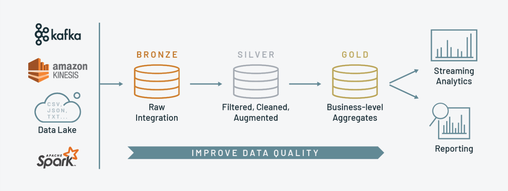

# Projeto Final do Módulo de Big Data da ADA
### Projeto de Desenvolvimento e Avaliação de uma Arquitetura Distribuída para o Cadastro Ambiental Rural

## Sumário

- [Objetivo](#objetivo)
- [Desafio](#desafio)
- [Dados](#dados)
- [Pré-requisitos](#Prerequisitos)
- [Introdução](#introdução)
- [Arquitetura](#arquitetura)
- [Databricks](#databricks)
- [Particionamento](#Particionamento)
- [Grupo](#grupo)

## Objetivo
O objetivo deste projeto é explorar as capacidades de arquiteturas de bancos de dados distribuídos para lidar com grandes conjuntos de dados, em particular, o "Cadastro Ambiental Rural". Nesse projeto é proposta uma nova arquitetura, além de modelar os dados de acordo com as especificações e projetar um particionamento efetivo.

## Desafio
O Cadastro Ambiental Rural é um banco de dados que contém informações sobre propriedades rurais no Brasil. Dada a sua magnitude, o desafio é projetar uma arquitetura que permita o gerenciamento eficiente desses dados, proporcionando consultas e análises rápidas.

## Dados 📈
Foram utilizados os dados oficiais de [Cadastro Ambiental Rural](https://dados.gov.br/dados/conjuntos-dados/cadastro-ambiental-rural1) no site Gov.br.

## Pré-requisitos
- 
- 
- 
- 
- 

## Introdução

### O que é Big Data?

Big Data se refere a conjuntos de dados tão grandes e complexos que os métodos tradicionais de processamento de dados não são adequados. Essas enormes quantidades de dados vêm de várias fontes, como mídias sociais, sensores IoT, transações financeiras, registros médicos, entre outros. Para lidar com Big Data, são necessárias tecnologias e arquiteturas especializadas para armazenamento, processamento e análise eficientes.

## Arquitetura 🏛️
A **Arquitetura Medalhão (Medallion Architecture)** é um padrão de design de dados usado para organizar logicamente os dados em um lakehouse, com o objetivo de melhorar, de forma incremental e progressiva, a estrutura e a qualidade dos dados, à medida que estes fluem através de cada camada da arquitetura (Bronze ⇒ Silver ⇒ Gold).

Fonte: https://www.advancinganalytics.co.uk/blog/medallion-architecture

1. **Raw**: Camada onde há a ingestão e armazenamento dos dados brutos, exatamente como chegam das fontes de dados, para preservação e fidelidade dos dados originais.
2. **Bronze**: Camada onde há a ingestão dos dados brutos e um pré-tratamento dos dados, realizando-se uma limpeza com remoção de dados nulos e alterações de nomes de colunas. Serve como uma área de staging.
3. **Silver**: Camada intermediária onde os dados são transformados. Nesta etapa, são removidos erros, duplicatas e outros problemas de qualidade.
4. **Gold**: Camada final onde os dados estão altamente curados e otimizados para análise através de consultas. Dados nesta camada são usados para relatórios, dashboards e análises avançadas.

## Databricks 🎲
Databricks é uma plataforma unificada de análise de dados, criada pelos desenvolvedores do Apache Spark. 

Utiliza clusters para processar grandes volumes de dados de forma distribuída e oferece notebooks interativos no estilo IPython. Isso facilita a exploração de dados, a colaboração em tempo real e o desenvolvimento de pipelines de dados, integrando-se facilmente com diversas fontes e ferramentas de big data.

## Particionamento

Para um particionamento mais efetivo, foi projetado um esquema de particionamento por estado, para garantir a distribuição eficiente dos dados, permitindo consultas rápidas.

## Consultas 🔎

### Consulta 1:
Recuperar a soma de área (em hectares) para todas as propriedades agrícolas que pertencem ao MS e MT. Ordene os resultados em ordem decrescente.
### Consulta 2:
Filtrar todas as propriedades que pertecem a região sudeste.
### Consulta 3:
Calcular quantas propriedades foram cadastradas por ano. Apresente os resultados em ordem cronológica.
### Consulta 4:
Calcular o percentual médio de área remanescente de vegetação nativa em comparação a área total da propriedade
### Consulta 5:
Construa uma consulta que mostre a contagem de propriedades rurais por estado.
### Consulta 6:
Faça a média de área entre todas as propriedades. Calcule quantas propriedades por
estado, estão acima da média. 

## Grupo

O Grupo 2 é composto por:

- Caio Brainer
- Carlos Caldeira
- Sormanny Junior
- Thaísa Elvas
- Thascilla Rosa
- Thatiana Napolitano
